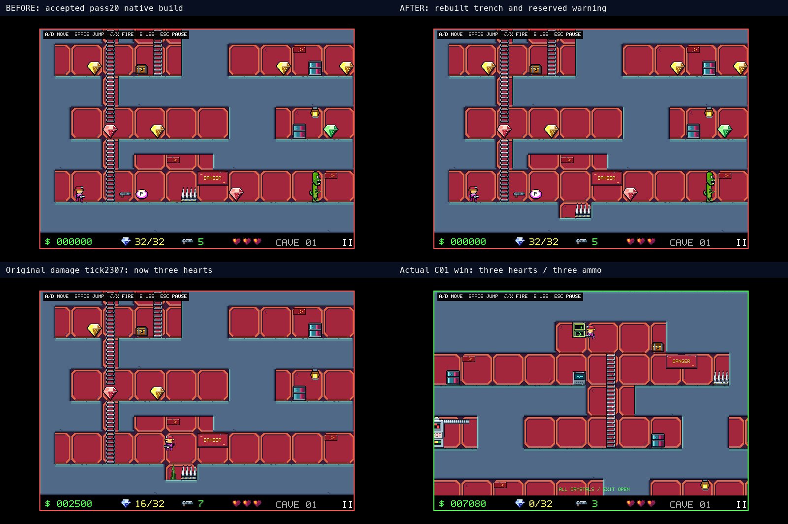
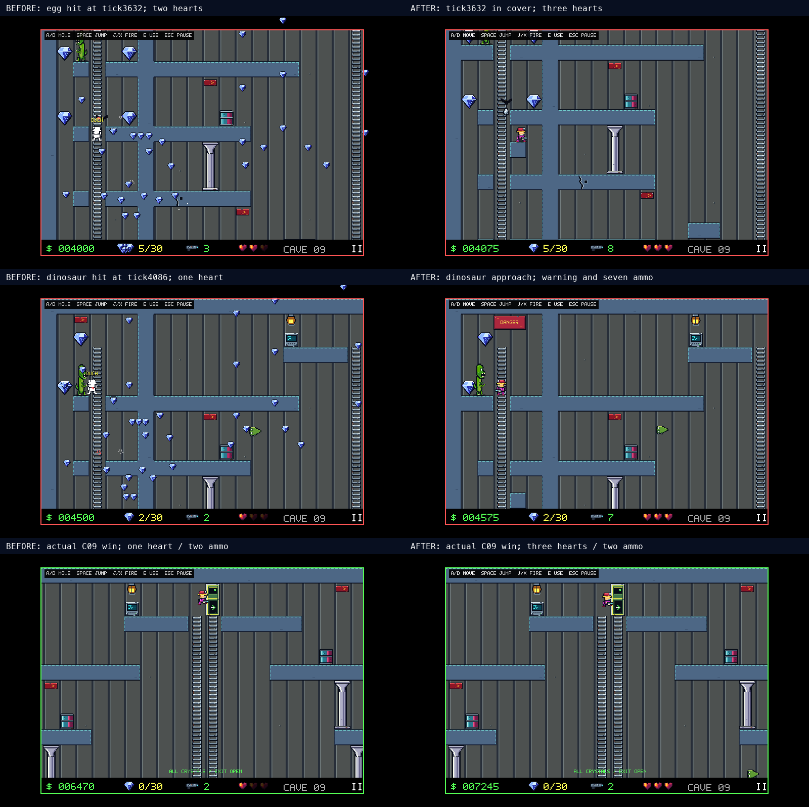
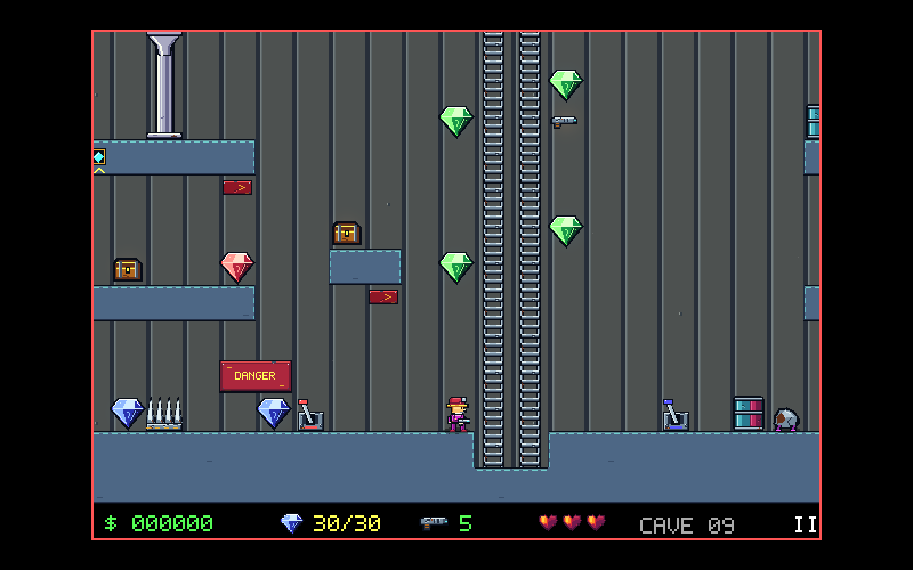

# Gameplay polish review evidence

Selected source-map and native-player captures from the 26 gameplay evaluation
passes on 2026-10-07. The [cave-by-cave plan](../gameplay-polish.md) lists completed
changes, exact coordinates and remaining work for all sixteen caves.

The game grades improved from **B− game / C+ original feel** to **B game / B−
original feel**. Cave design remains B−. The accepted remaster artwork remains;
enemy behavior and secrets are reference-informed, with no claim of exact DOS
movement or timing parity.

## Source-map comparisons

Amber circles identify review sites; colored boxes locate edits. These renders
show the authoritative layouts, rather than a Unity playthrough.

- [All sixteen caves and remaining review sites](all16-polish-targets.png)
- [Passes 1–10: tools, ammo, optional shelf and sealed actor relocations](round1-source-changes.png)
- [Passes 11–15: caches and rewarded platform alternatives](round2-source-changes.png)
- [Passes 16–20: opening ceiling, upper branch and optional FREEZE](round3-source-changes.png)
- [Pass 21: Ore Shaft return trench](ore-shaft-source-changes.png)
- [Passes 22–26: Twin Vaults cover, patrol floor and ammo](twin-vaults-source-changes.png)

## Ore Shaft

The opening ceiling now has enough clearance for the ordinary jump. The existing
thorn and spike move down one tile into a shallow trench at `(8,22)` and `(9,22)`;
the upper floor and the supporting bottom row remain. DANGER at `(10,20)` reserves
its bay before scenery.

The [complete fixed-input regression](../../tests/test_classic_ore_shaft_route.py)
starts from normal spawn with three hearts, five ammo, all six actors alive,
32 counted crystals, the cache unrevealed and exit locked. Seven return takeoffs
spanning 28 pixels all win at tick 3,794 with three hearts, three ammo and score
7,080. Six of the seven lost a heart before the trench edit. Walking into either
hazard still causes damage; ordinary inputs can escape in either direction.

## Twin Vaults

The previous complete route won with one heart after an egg hit and a dinosaur
hit. The new covered rest `(4,12)` sits below the existing overhead floor. Filling
floor `(1,6)` gives the dinosaur 36.27 pixels of patrol rather than 2.27. The
existing ammo moves from `(31,13)` to `(21,13)` on the central route, and DANGER
`(3,1)` marks the upper chamber. The dinosaur retains five health; chain 3 and the
floor spike `(10,21)` remain.

The [complete fixed-input regressions](../../tests/test_classic_twin_vaults_route.py)
start normally with three hearts, five ammo, all six actors alive, both gates
closed and all 30 crystals including the unrevealed cache. Neither route uses
teleports, actor removal, immunity changes or resource assignments.

| Route | Win ticks | Shots | Hearts | Ammo | Damage |
|---|---|---|---|---|---|
| Collect ammo, rest under cover, shoot dinosaur | 5,075 / 5,079 / 5,083 / 5,087 / 5,091 | 8 | 3 | 2 | None in five rest timings |
| Collect ammo, rest under cover, preserve dinosaur | 4,971 | 3 | 2 | 7 | One dinosaur hit at 4,087 |

Five ordinary bullets defeat the five-health dinosaur. Both strategies collect
the counted cache, every crystal and both gates. A no-hit ammo-saving strategy
remains unproved. A separate 1,000-frame waiting test stays safe while the live
bat continues dropping eggs.

## Acid Vents FREEZE

The only FREEZE pickup moves from `(8,9)` to `(8,8)` beside chain 9. Floor traversal
can leave it; climbing collects it. A regional checkpoint comparison uses the
same 293 input frames in every condition, with all six actors alive and ordinary
damage enabled.

| Enemy warmup | Without FREEZE | Previous placement with FREEZE | Current placement with FREEZE |
|---|---|---|---|
| 0 frames | 3 hearts | 3 hearts | 3 hearts |
| 70 frames | 2 hearts | 3 hearts | 3 hearts |
| 140 frames | 3 hearts | 3 hearts | 3 hearts |

The relocation adds choice; the health benefit also exists at the previous
placement. Frozen contact still hurts. The [source regression](../../tests/test_classic_freeze_route.py)
includes bypass, pickup, snapshot timer hold, expiry, reset and contact damage.
Normal-spawn access and a complete cave win remain unverified.

[Native review of the ceiling, upper branch, FREEZE and winning states](round3-native-changes.png)
shows earlier pass-20 evidence.

## Validation

Pass 26 completed 1,823 Python tests, Black/Ruff/mypy, 67 fresh Unity editor
checks and the documented native rebuild. The editor categories are 12 controls,
23 power/cache feedback, 16 settings and 16 snapshot parsing checks. C09's fresh
geometric analysis reaches all 30 crystals, both switches/gates and the exit
without truncation. All sixteen geometric checks passed in pass 20; C01 was
rechecked in pass 21. Geometry excludes combat, trap timing, collection ordering
and secret reveal, which the complete routes test separately.

A clean source export excluding ignored inputs reproduced all 283 resources
exactly. Campaign counts are 488 crystals (two hidden), 13 switches, 13 gates,
97 actors, 27 treasures, 19 ammo pickups, four P pickups, one FREEZE and 761
chain cells. Training layouts and checkpoint action/observation dimensions stay
compatible. New independent human button combinations are never saved as
misleading legacy demonstrations.

Reproduce the Python gate with `make verify`. Run the native editor checks with
Unity's `-executeMethod CrystalCaves.Pilot.Editor.CaveGameplayChecks.Run`, and
build using `python scripts/unity_pilot.py --build-only`. The raw local logs are
kept outside the tracked review package; PR checks separately establish Linux CI.

## Native keyboard

The documented launcher opened the title screen; C, Down and Return selected
and loaded C09 normally with three hearts, five ammo and 30 crystals. The moved
ammo was visible, F12 saved the gameplay capture and Escape opened pause.

Seventeen actual authoritative C09 snapshots rendered in the rebuilt player at
1600×1000, covering ammo, cache, cover, dinosaur approach/five hits, the actual
floor-spike takeoff/crossing and exit win. Capture pacing was two images per
second, with particles temporarily disabled for sparse-frame readability and
saved preferences unchanged. Brief normal-play samples were 56–60 FPS; these
are not sustained frame-time or input-latency measurements.

The screenshots establish native rendering. The route tests establish simulated
human-button completion. Fourteen other complete routes, physical controller
acceptance, held simultaneous native keys, native full playthroughs, saved clear
credit, opening retry and measured original DOS timing remain unverified.
