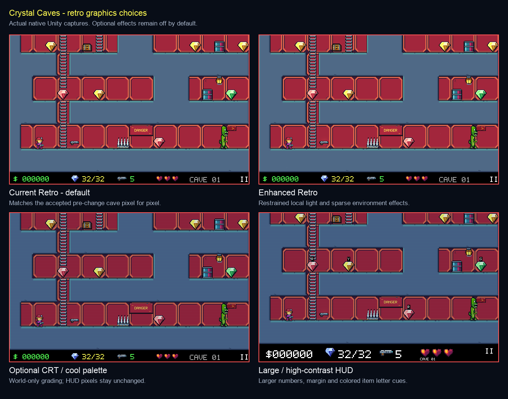

# Crystal Caves native visual review

Crystal Caves has its own Unity game experience, with Python retaining authoritative simulation and the optional AI Lab kept separate. The default Current Retro presentation matches the accepted cave image pixel for pixel. Enhanced Retro, CRT grading, lighting and environment motion are optional.

[Graphics comparison](graphics-comparison.png) shows Current Retro, Enhanced Retro, optional CRT/cool grading and the large HUD. [Settings overview](settings-overview.png) shows all four pages. These are native player captures, not mockups. Full-size captures are in the `native-menus/` and `native-render/` directories.



## Implemented settings

| Area | Controls |
| --- | --- |
| Display | Window/fullscreen, remembered window size, 15-second Keep/Revert, VSync, frame cap and FPS counter, integer pixel scale, adaptive/classic/wide framing. |
| Graphics | Current Retro / Enhanced Retro / Low Power presets, independent shake/particles/glints, decorative density, environmental motion, local light, contact shadows/strength, brightness, palettes, scanlines and phosphor. |
| Sound | Master/effects volume, mute and preview of the actual raygun cue while paused. |
| Accessibility | Reduced motion, damage flashes, HUD position/scale/margins/contrast, item symbols and screenshot HUD preference. |
| Screenshot | Paused cave with frozen visual time, optional hidden HUD, F12 capture and visible saved-path feedback. |

The accepted game layouts are pinned in `src/unity_bridge/classic_layouts.py`; training-map rebalances therefore cannot move exported terrain, collectibles or trap sites. The newer research layouts remain available through the training profile.

The live cave preview stays paused while settings change. Presets preserve window dimensions, audio and accessibility choices. Reduced motion keeps essential enemy/lift/projectile/hazard poses. World grading leaves HUD/menu colors unchanged. Rendering frame caps retain the simulation's fixed 60 Hz clock.

## Native validation

42 settings/native behavior checks passed: [16 editor settings checks](settings-checks.json), [9 native menu checks](native-menus/settings-report.json), [6 native display checks](native-display/settings-report.json), [6 render checks](native-render/settings-report.json) and [5 VSync checks](native-vsync/settings-report.json).

Fullscreen apply, native window restoration, Keep and automatic rollback passed on an unlocked desktop on 2026-10-06. The earlier locked-desktop attempt was not native fullscreen proof. Physical controller acceptance remains unverified. The native runs used Apple Silicon; the Metal helper builds for both arm64 and x86_64, while other platforms use Unity's standard VSync API and have not been run here.

The default [Current Retro capture](native-render/current-retro.png) matches [the accepted baseline](before-retro.png) pixel for pixel. Brightness/palette/CRT change cave pixels while the HUD remains exactly equal. [The saved screenshot](native-menus/saved-game.png) excludes HUD and capture controls. A separate live Python-to-Unity smoke passed, covering all sixteen cave loads, menus, game-over/restart and actual main-mine doorway entry/return. Its completion views were explicit fixtures, not full winning routes; no model was loaded in that run.

This evidence does not establish physical controller acceptance, complete winning routes or resolution of the previously recorded ordinary-startup limitation. The application still requires the local Python bridge.

## Reproduce

Build from the repository root with `python scripts/unity_pilot.py --build`, then quit the ordinary player before isolated reviews. With the desktop unlocked:

```bash
python scripts/review_unity.py menus
python scripts/review_unity.py display
python scripts/review_unity.py render
python scripts/review_unity.py vsync
```

The driver stages a copy outside Documents, uses the [real-input red-cave snapshot](review-state.json), writes logs/captures to `.Codex/artifacts/unity-pilot/settings-CASE`, and closes only its own staged player. Temporary reviews do not write player settings or achievements. A skipped acceptance condition, timeout or failed assertion returns a failure.

Editor settings checks run via `CrystalCaves.Pilot.Editor.CaveSettingsChecks.Run`; the player accepts `--settings-smoke`, `--settings-case` and `--settings-state` for direct integration. See [launch instructions](../../unity/README.md), [settings/display implementation](../../unity/Assets/Scripts/CaveSettings.cs), [settings UI](../../unity/Assets/Scripts/CaveOptions.cs) and [native behavior scenarios](../../unity/Assets/Scripts/CaveSettingsSmoke.cs).

The full local audit archive stays outside git. This folder contains the accepted baseline, representative final captures, exact review input and structured validation reports.
